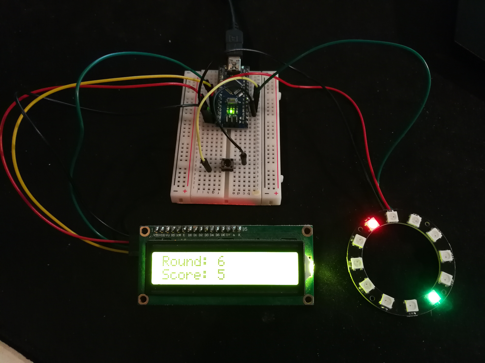
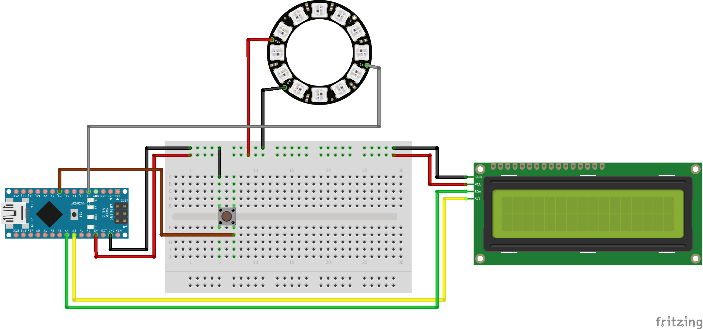

# Game Cyclone for Arduino Nano

## Game instruction
If you watch the video (https://www.youtube.com/watch?v=5HFTi8qphDA&feature=emb_logo), 
the principle is quickly explained. You have a target marker which is displayed on the 
LED ring. The player point runs over the ring at a defined speed and you have to try 
to press a key as soon as the player point is congruent with the target marker. Unlike
in the video, I don't have levels, but is a continuous game until once the target marker 
is not hit. In addition, there is an LCD display that shows highscore and current round.

## Wiring

## Code
Install the library Adafruit NeoPixel an upload the code via Arduino IDE.
Have fun ;)