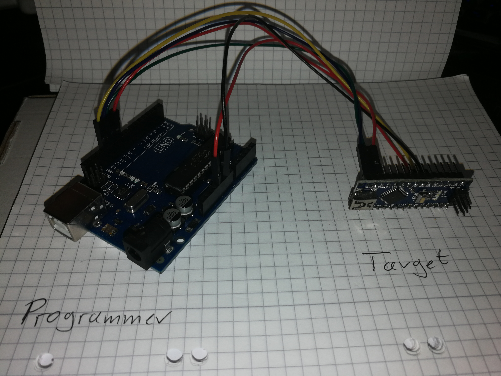

# Flash arduino bootloader
Simple blog (german) how to flash an arduino bootloader with another arduino. 
Also there are some more information about other bootloaders and options. 

1. [Arduino Uno](https://www.az-delivery.de/collections/arduino-kompatible-boards/products/uno-r3)
2. [Arduino Nano](https://www.az-delivery.de/products/nano-v3-mit-ch340-arduino-kompatibel?_pos=1&_sid=1ecc7df97&_ss=r)

