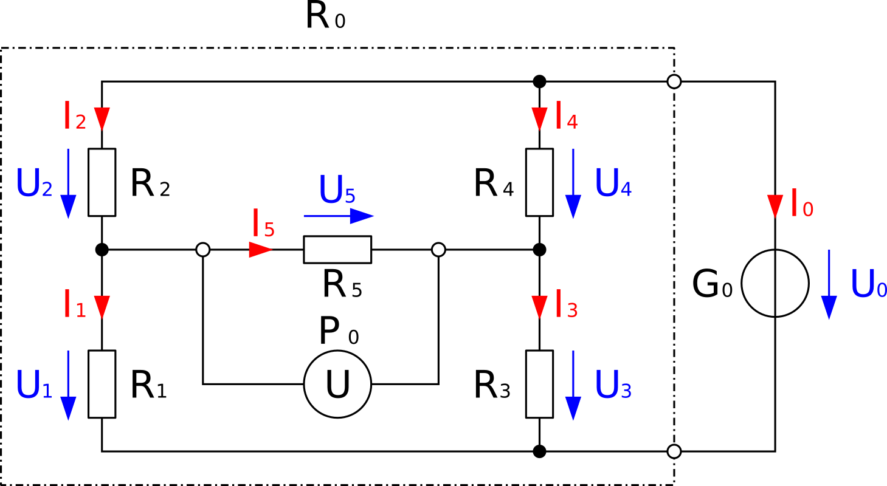

# Basic information H-Bruecke

##Copyright information
Some pictures use a copyright, so here are the names from the creators:
- Wikipedia MovGP0 
- Wikipedia Biezl 

## Release
Version 1 release Feb. 13 2021

## Short description
Basic information about the H-bridge or Four-quadrant controller.
Includes some sample with wiring and code, to see how a simple control is working.
These are the basics to create a little robot car.

## Code
Little samples to control a motor with H-bridge with an NANO v3.0 or ESP32