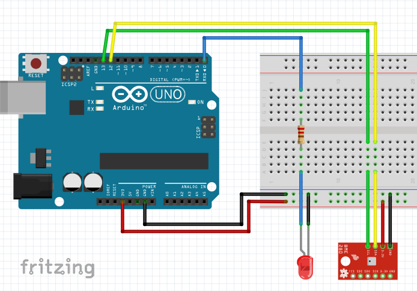

# HowTo Fritzing (German)
German instruction how to turn an idea into a schematic drawing
or circuit diagram or printed circuit board easily and quickly 
with Fritzing. Different tricks with the software are explained.
In the end all three views for creating a project should be 
explained. The highlight will be the creation of an own component
in the Fritzing component editor.

## Needed software
[Fritzing](https://fritzing.org/download/) is required for this project. 
Additionally, the [Arduino IDE](https://www.arduino.cc/en/Main/Software) 
can be installed to develop code for the Arduino boards directly in Fritzing later.

## Structure
1. How to create a schematic drawing (Part 1 Released 04.07.2020)

