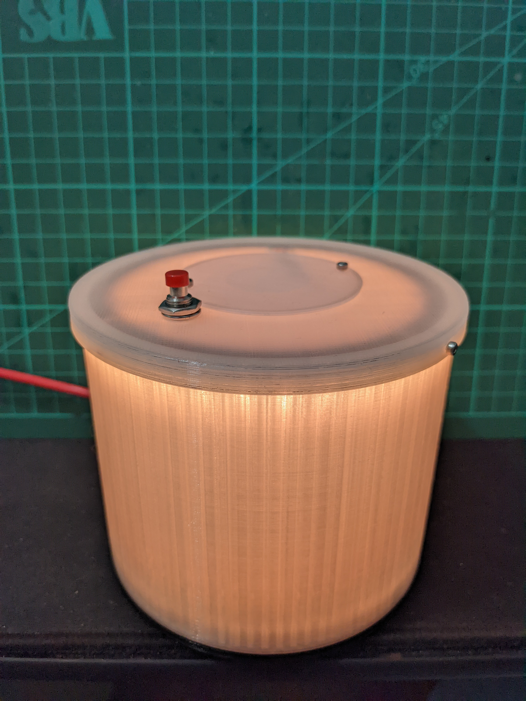

# Raspberry Pi Pico Nightlight

## Description
This is a simple nightlight for kids with changing color. A button starts the light and will automaticaly turn off after 15 min.

## Code
Copy both Python-files from folder "Program" to the Raspberry Pi Pico. The simple way is via Thonny.

## Drawings
These are the exports from my created Fusion 360 files.