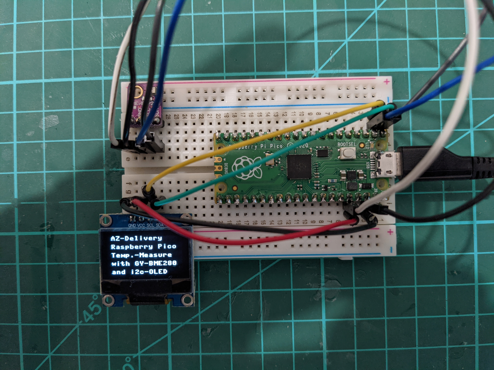

# Pico Weatherstation

Simple example with Raspberry Pi Pico and BME280 and OLED-Display to get temperature, huminity and preasure information.
This is a starting code example with MicroPython, so very easy to use.

##Parts you need
1. [Raspberry Pi Pico](https://www.az-delivery.de/products/raspberry-pi-pico)
2. [0,96 Zoll OLED SSD1306 Display I2C](https://www.az-delivery.de/products/0-96zolldisplay)
3. [Breadboard und Jump Wire](https://www.az-delivery.de/products/breadboard-kit-3-x-65stk-jumper-wire-kabel-m2m-und-3-x-mini-breadboard-400-pins-fuer-arduino-raspberry-pi)
4. [GY-BME280 Barometrischer Sensor](https://www.az-delivery.de/products/gy-bme280)