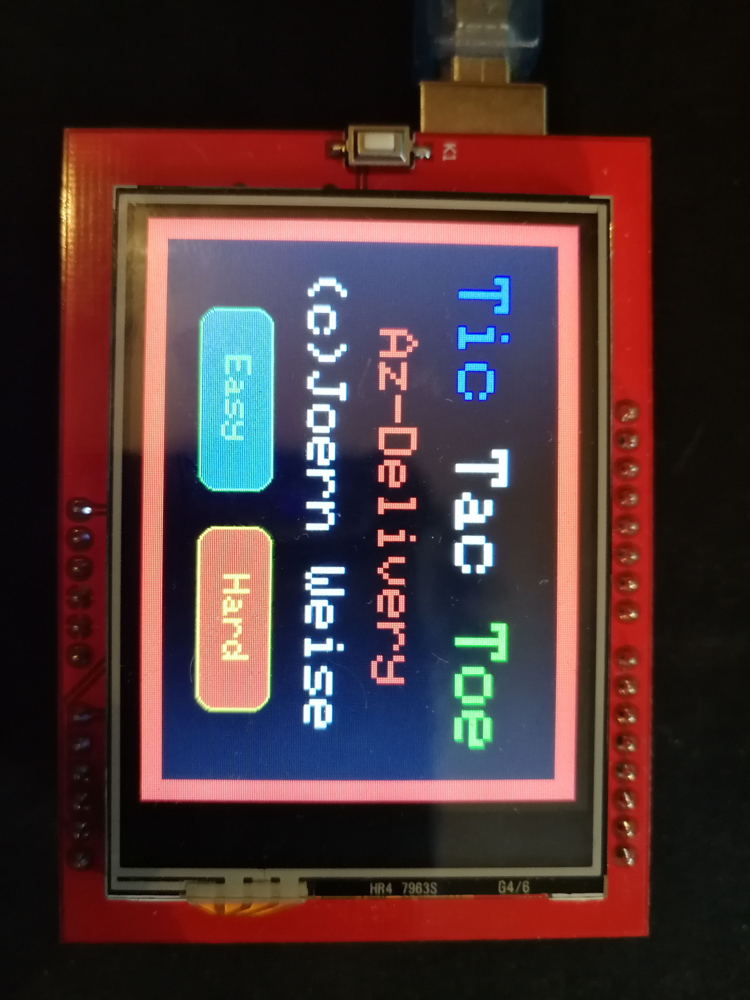
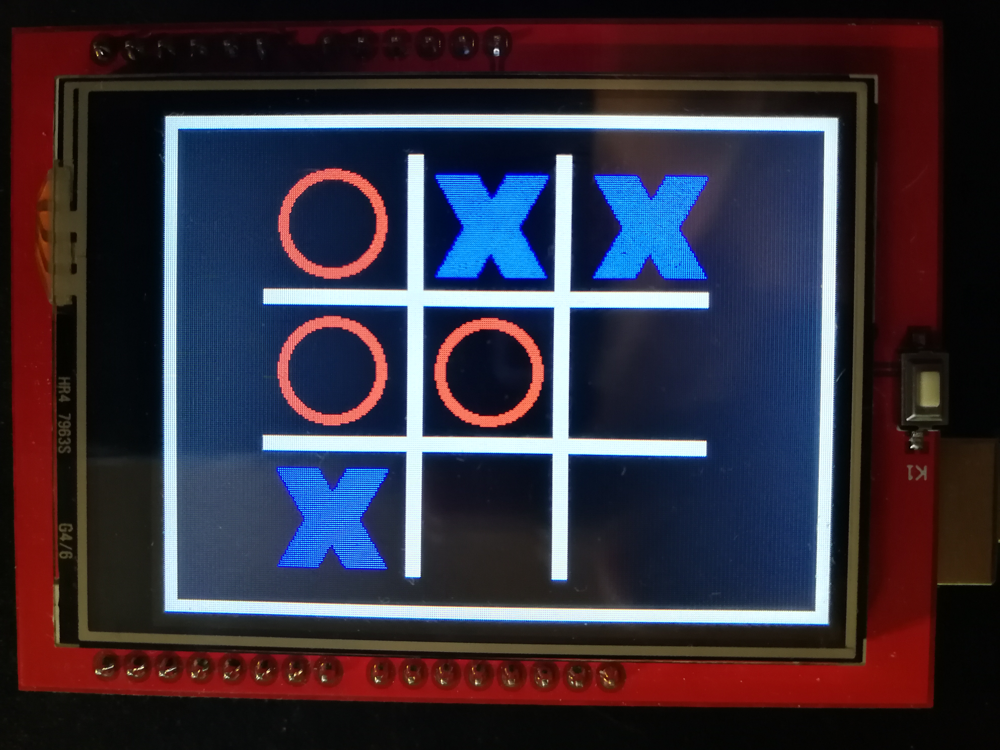

# TicTacToe with Arduino Uno and 2,4" Touchdisplay
Simple game on an Arduino Uno with 2,4" touchdisplay. 

1. [Arduino Uno](https://www.az-delivery.de/collections/arduino-kompatible-boards/products/uno-r3)
2. [2.4" TFT LCD Touch Display](https://www.az-delivery.de/products/2-4-tft-lcd-touch-display?_pos=3&_sid=4c9b9cc77&_ss=r)

and adding the following libaries with all dependencies
1. MCUFRIEND_kbv

Don't forget to copy graphics.c in the project-folder from TicTacToe!

