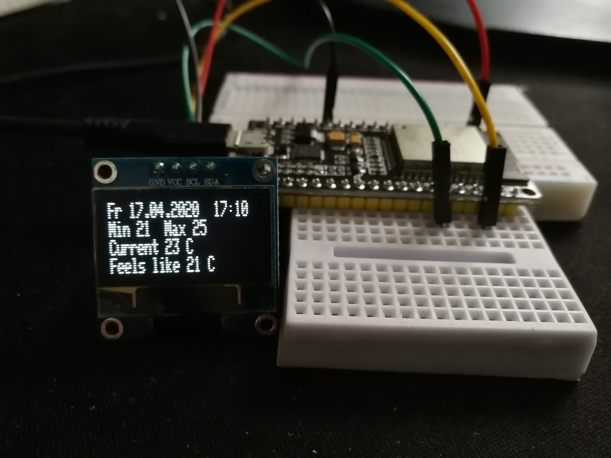

# Weatherstation part 1
Lets start simple with our weatherstation. First we want to know the weather data for our location and want to display them
on a simple OLED-display. Every 5 minutes we want to have the newest weatherforecast and every minute an update to our output.

1. [ESP32 NodeMCU](https://www.az-delivery.de/products/esp32-developmentboard?_pos=24&_sid=69909e42c&_ss=r)
2. [0.96" OLED i2c Display ](https://www.az-delivery.de/products/0-96zolldisplay?_pos=14&_sid=03d542ee1&_ss=r)
3. [Jumper wire cable female to male](https://www.az-delivery.de/products/40-stk-jumper-wire-female-to-male-20-zentimeter?_pos=20&_sid=5cfea44cd&_ss=r)
4. An account from [Openwaethermap.org](https://openweathermap.org/)

After connecting like shown below

and adding the following libaries
1. NTPClient
2. WiFi
3. Adafruit SSD1306
4. ArduinoJson
5. Time

and uploading the ion-File (**after modifing the TODOs**) to NodeMCU, the result looks like

